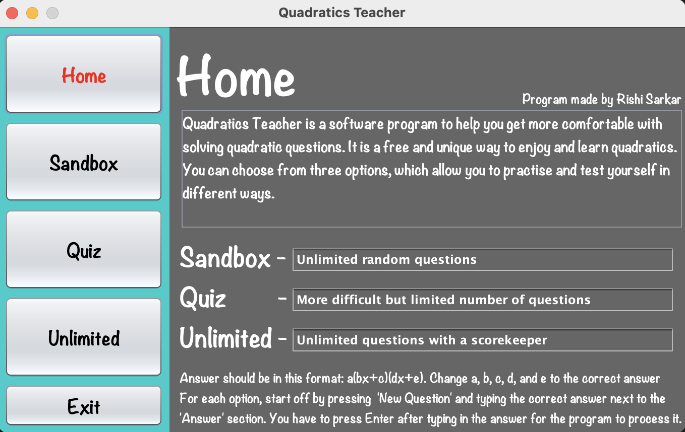
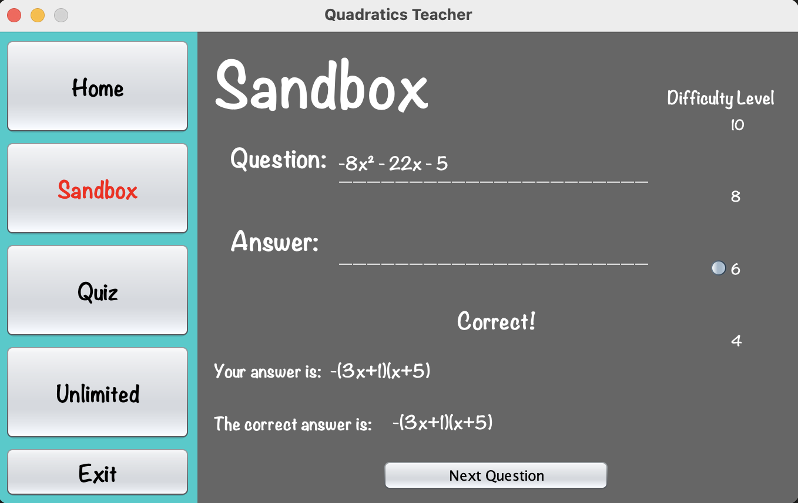
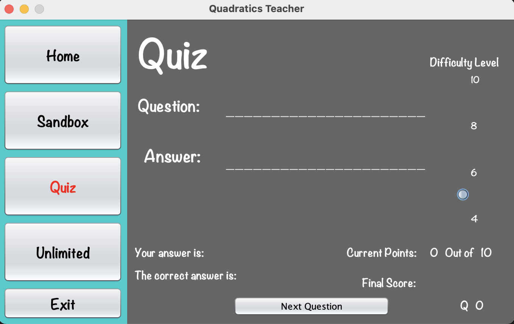
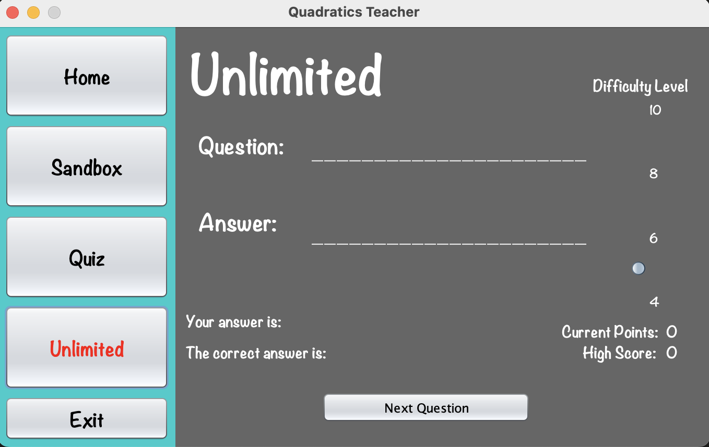

# Quadratic Teacher

**Quadratic Teacher** is a software program to help you practice and become more comfortable with factoring quadratic equations. It is a free and unique way to enjoy and learn about quadratics. The application presents multiple modes and difficulty levels to allow you to practice at your own pace and challenge yourself.

## Features

- **Sandbox**  
  Unlimited random questions for practicing factoring skills.  
  Move the difficulty slider to increase the magnitude of the coefficients.

- **Quiz**  
  A set of 10 questions at a time to test your skills.  
  Displays your current and final score out of 10.

- **Unlimited**  
  Unlimited questions with a tracker of consecutive correct answers.  
  Keep playing until you get one wrong, and track your high score.

Each format has a difficulty level (shown on the right side of the interface) that you can adjust to generate more complex quadratics. The module is designed to be flexible with your answer entry—extra spaces or omitting the coefficient `1` (e.g., `(x+2)` vs. `(1x+2)`) are accepted.

### Screenshots

**Home Screen**  


The Home screen introduces the main modes: Sandbox, Quiz, and Unlimited. You can choose any mode to start practicing.

**Sandbox Mode**  


In the Sandbox, you can generate unlimited random questions. Enter your factored form in the `Answer` field and press Enter. If you get the correct factoring, you’ll see a confirmation below.

**Quiz Mode**  


In Quiz mode, you’ll receive 10 questions in total. Your current points and final score are shown at the bottom-right.

**Unlimited Mode**  


In Unlimited mode, a correct answer keeps your streak going, and the streak count is displayed on the right. Aim for a high score!

## How to Run

1. **Clone this repository**

   ```bash
   git clone https://github.com/rishi-sarkar/Quadratic-Teacher.git

   ```

2. **Open in Apache NetBeans**

   - Launch Apache NetBeans.
   - Go to **File → Open Project...**.
   - Browse to the folder where you cloned the repository.
   - Select the **Quadratic-Teacher** folder and click **Open Project**.

3. **Run the Project**

   - In the Projects pane, locate `QuadraticTeacher.java`.
   - Right-click on `QuadraticTeacher.java` and select **Run File**  
     _or_
     - Ensure `QuadraticTeacher.java` is set as the main class in **Project Properties** and click **Run Project**.

4. **Enjoy Practicing!**

   - Choose **Sandbox**, **Quiz**, or **Unlimited** mode from the Home screen.
   - Adjust the **Difficulty** slider to generate more challenging equations.
   - Type your factored form in the **Answer** field and press **Enter** to see if you’re correct.

---

## License

This project is licensed under the [MIT License](LICENSE). See the full text below:

MIT License

Copyright (c) [2025]

Permission is hereby granted, free of charge, to any person obtaining a copy of this software and associated documentation files (the "Software"), to deal in the Software without restriction, including without limitation the rights to use, copy, modify, merge, publish, distribute, sublicense, and/or sell copies of the Software, and to permit persons to whom the Software is furnished to do so, subject to the following conditions:

The above copyright notice and this permission notice shall be included in all copies or substantial portions of the Software.

THE SOFTWARE IS PROVIDED "AS IS", WITHOUT WARRANTY OF ANY KIND, EXPRESS OR IMPLIED, INCLUDING BUT NOT LIMITED TO THE WARRANTIES OF MERCHANTABILITY, FITNESS FOR A PARTICULAR PURPOSE AND NONINFRINGEMENT. IN NO EVENT SHALL THE AUTHORS OR COPYRIGHT HOLDERS BE LIABLE FOR ANY CLAIM, DAMAGES OR OTHER LIABILITY, WHETHER IN AN ACTION OF CONTRACT, TORT OR OTHERWISE, ARISING FROM, OUT OF OR IN CONNECTION WITH THE SOFTWARE OR THE USE OR OTHER DEALINGS IN THE SOFTWARE.
